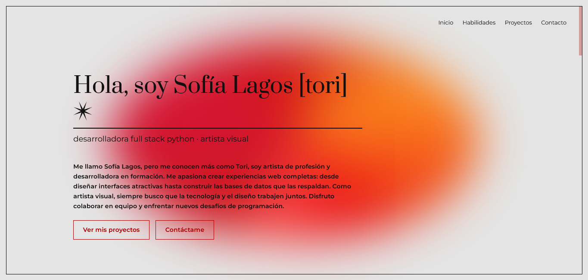
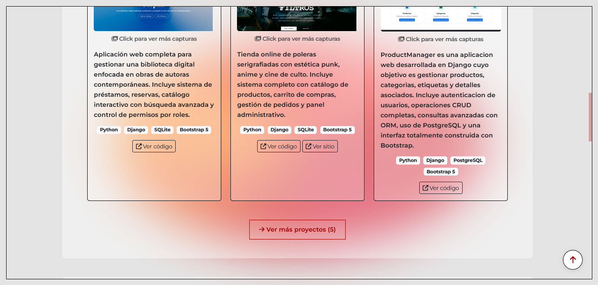
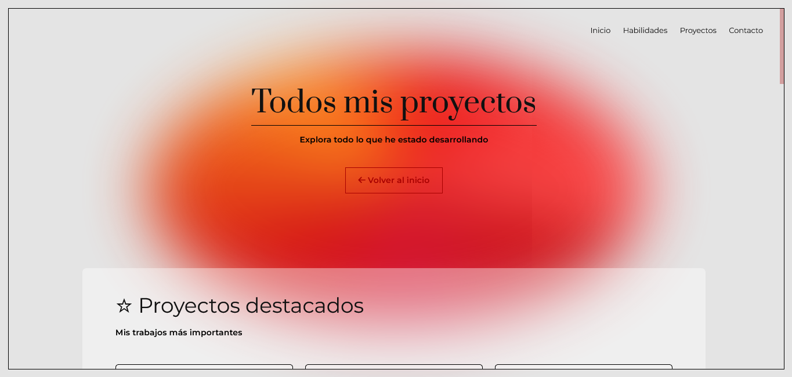
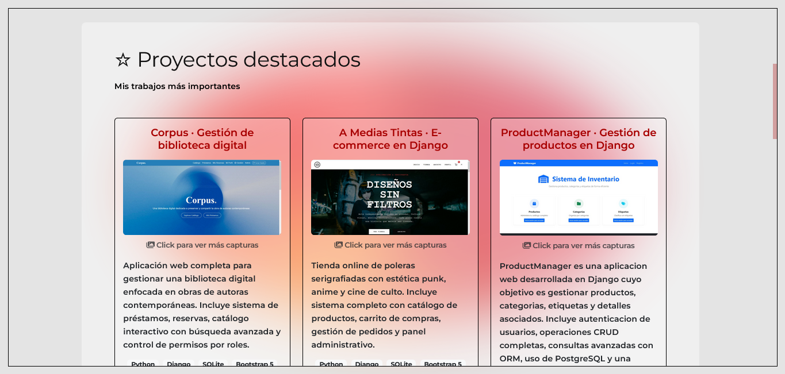
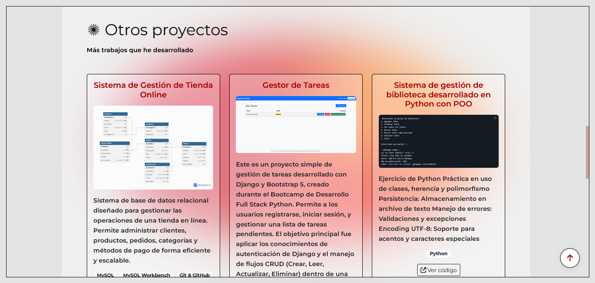
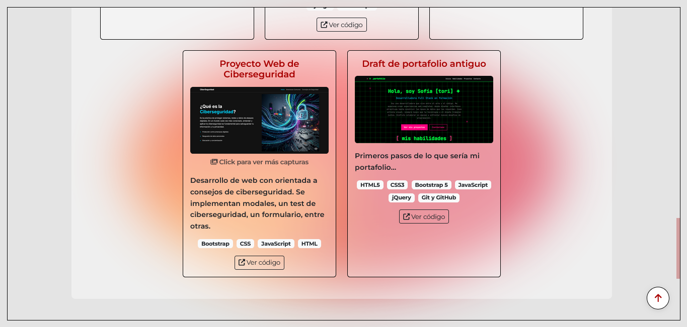

# Portafolio Django

Portafolio personal desarrollado con Django como proyecto final para Talento Digital. Adaptación de mi [portafolio estático](https://github.com/too0oori/Portafolio) a una aplicación web dinámica con panel de administración completo.

## Características principales

### Gestión de contenido mediante Django Admin
- **Perfil personal**: Información básica, redes sociales e ilustración de contacto
- **Proyectos**: Sistema de proyectos destacados y regulares con múltiples imágenes
- **Habilidades**: Clasificación en técnicas y personales con iconos personalizables
- **Mensajes de contacto**: Formulario funcional con gestión de mensajes desde el admin

### Mejoras respecto al portafolio estático
- **Base de datos PostgreSQL**: Contenido completamente dinámico y editable
- **Panel de administración personalizado**: Interfaz intuitiva con acciones rápidas y validaciones
- **Sistema de imágenes múltiples**: Carruseles modales para mostrar capturas de proyectos
- **Formulario de contacto**: Envío y almacenamiento de mensajes en la base de datos
- **Arquitectura escalable**: Separación de concerns con templates reutilizables

## Estructura del proyecto

```
portafolio/
├── main/                      # App principal
│   ├── models.py             # Modelos: Perfil, Proyecto, Habilidad, Contacto
│   ├── views.py              # Vistas: index, todos_proyectos
│   ├── forms.py              # Formulario de contacto
│   ├── admin.py              # Configuración del panel de administración
│   └── urls.py               # URLs de la app
├── templates/
│   ├── base.html             # Template base con navbar y footer
│   ├── index.html            # Página principal
│   ├── proyectos.html        # Galería completa de proyectos
│   └── partials/             # Componentes reutilizables
│       ├── _proyecto_card.html    # Tarjeta de proyecto
│       └── _proyecto_modal.html   # Modal con carrusel
├── static/
│   ├── css/
│   ├── js/
│   └── img/
└── portafolio/               # Configuración Django
    ├── settings.py
    └── urls.py
```

## Decisiones de diseño

### Templates parciales (partials)
Se implementaron componentes reutilizables para mantener el código DRY:
- `_proyecto_card.html`: Tarjeta de proyecto usada tanto en index como en la página de proyectos
- `_proyecto_modal.html`: Modal con carrusel de imágenes, evitando duplicación de código

### Modelos y relaciones
- **Perfil**: Singleton que previene múltiples registros mediante validación
- **Proyecto**: Campo `destacado` para diferenciar proyectos principales
- **ImagenProyecto**: Relación ForeignKey con `related_name='imagenes'` para carruseles
- **Contacto**: Campo `leido` para gestionar seguimiento de mensajes

### Admin personalizado
- Fieldsets organizados por categorías lógicas
- List displays con información relevante y acciones rápidas
- Inlines para gestionar imágenes de proyectos sin cambiar de página
- Acciones masivas para marcar mensajes como leídos
- Validaciones que previenen errores (solo un perfil, no eliminar imágenes)

### Imágenes









## Tecnologías utilizadas

- **Backend**: Django 5.2.9, Python 3.x
- **Base de datos**: PostgreSQL
- **Frontend**: Bootstrap 5.3, JavaScript vanilla
- **Tipografías**: Montserrat, Prata (Google Fonts)
- **Iconos**: Font Awesome 6.5

## Instalación y configuración

### Requisitos previos
- Python 3.8+
- PostgreSQL
- pip

### Pasos de instalación

1. **Clonar el repositorio**
```bash
git clone https://github.com/too0oori/Portafolio_Django.git
cd Portafolio_Django
```

2. **Crear y activar entorno virtual**
```bash
python -m venv myenv
source myenv/bin/activate  # En Windows: myenv\Scripts\activate
```

3. **Instalar dependencias**
```bash
pip install requirements.txt
```

4. **Configurar base de datos PostgreSQL**
   
Crear base de datos:
```sql
CREATE DATABASE portafolio_db;
```

Ajustar credenciales en `portafolio/settings.py`:
```python
DATABASES = {
    'default': {
        'ENGINE': 'django.db.backends.postgresql',
        'NAME': 'portafolio_db',
        'USER': 'tu_usuario',
        'PASSWORD': 'tu_contraseña',
        'HOST': 'localhost',
        'PORT': '5432',
    }
}
```

5. **Aplicar migraciones**
```bash
python manage.py migrate
```

6. **Crear superusuario**
```bash
python manage.py createsuperuser
```

7. **Crear directorios para archivos media**
```bash
mkdir media media/proyectos media/proyectos/capturas media/perfil
```

8. **Ejecutar servidor de desarrollo**
```bash
python manage.py runserver
```

La aplicación estará disponible en `http://localhost:8000`

## Uso del panel de administración

Acceder a `http://localhost:8000/admin/` con las credenciales del superusuario.

### Configuración inicial recomendada

1. **Crear perfil**: Completar información personal y redes sociales
2. **Agregar habilidades**: Al menos 3-4 técnicas y 3-4 personales
3. **Crear proyectos**: Marcar 3-6 como destacados para la página principal
4. **Subir imágenes adicionales**: Para proyectos que requieran carruseles

### Gestión de proyectos

- **Destacados**: Aparecen en la página principal (máximo recomendado: 6)
- **Otros proyectos**: Visibles en `/proyectos/`
- **Orden**: Determina la secuencia de aparición (menor número = primero)
- **Tecnologías**: Separar por comas (ej: `Python, Django, Bootstrap`)

## Notas de desarrollo

### Sistema de archivos media
Los archivos subidos (imágenes de proyectos y perfil) se almacenan en `/media/`. En producción, se recomienda usar servicios como AWS S3 o Cloudinary.

### Variables de entorno
Para producción, mover `SECRET_KEY` y credenciales de base de datos a variables de entorno o archivos `.env`.

### Seguridad
- Cambiar `DEBUG = False` en producción
- Configurar `ALLOWED_HOSTS` apropiadamente
- Implementar HTTPS
- Usar variables de entorno para datos sensibles

## Diferencias principales con el portafolio estático

| Aspecto | Estático | Django |
|---------|----------|--------|
| Contenido | Hardcodeado en HTML | Dinámico desde base de datos |
| Actualización | Editar código manualmente | Panel de administración |
| Proyectos | Lista fija | CRUD completo con imágenes múltiples |
| Contacto | Solo visual | Formulario funcional con almacenamiento |
| Escalabilidad | Limitada | Fácil agregar funcionalidades |
| Backend | Ninguno | Django + PostgreSQL |

## Autor

**Sofía Lagos [tori]**
- GitHub: [@too0oori](https://github.com/too0oori)
- Email: sofia.lagos.cesped@gmail.com

---

Proyecto desarrollado como parte del programa Talento Digital - 2025